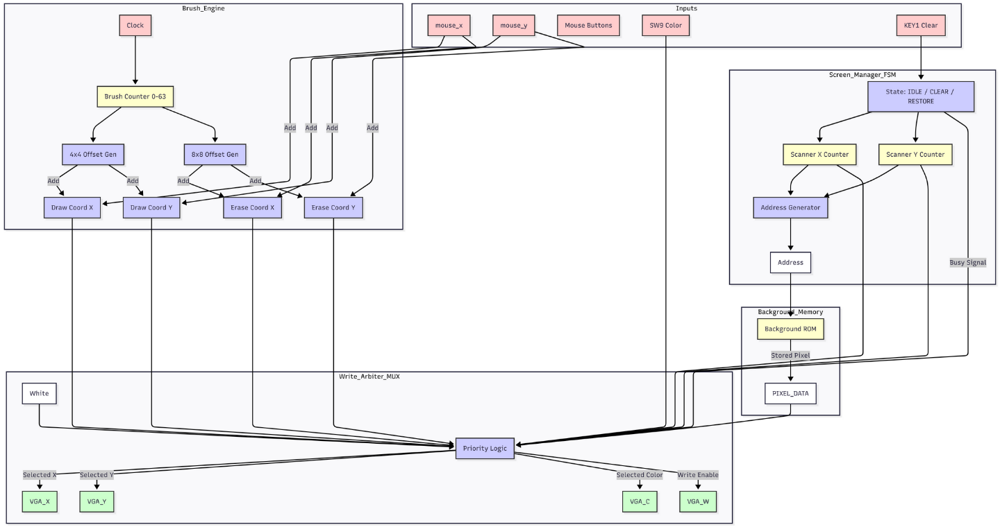
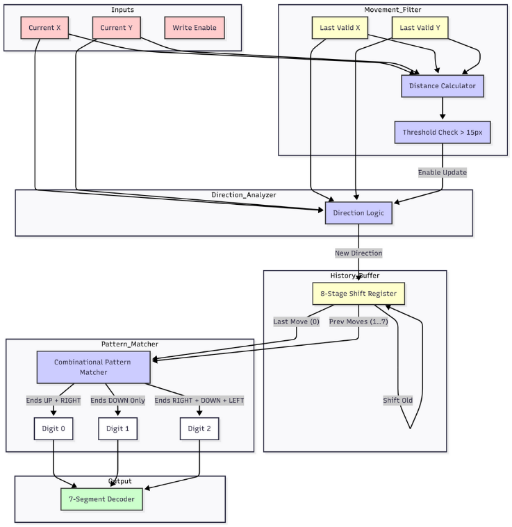
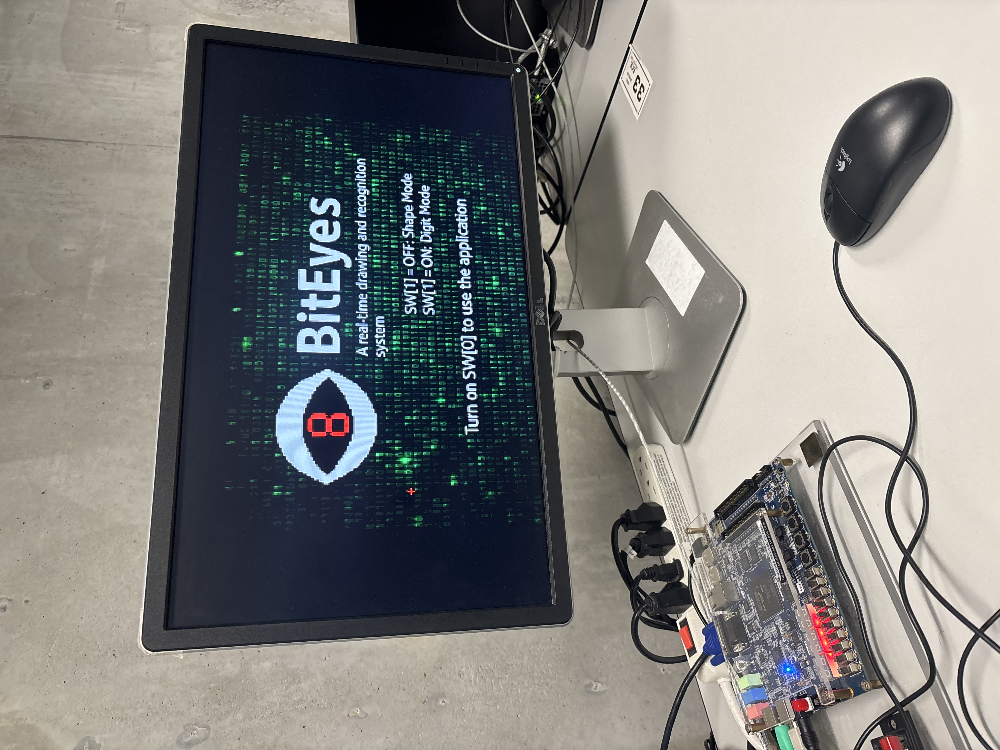

# BitEyes

BitEyes is a digital drawing canvas implemented on the **DE1-SoC FPGA** in **Verilog**.  
It features a VGA-based drawing surface, a custom PS/2 mouse driver with hardware-accelerated cursor movement, and two real-time pattern recognition engines for classifying **shapes** and **digits** as you draw.

---

## Source Code & Academic Integrity

This project was completed as part of **ECE241 (Digital Systems)** at the **University of Toronto**.  
To comply with university academic integrity policies and to avoid distributing complete assignment solutions, the **Verilog source files (`.v`) are intentionally *not* included in this repository**.

This repo is meant to showcase:

- The overall system architecture
- Design documentation
- Block diagrams, photos, and demo videos

If you are a student currently taking ECE241 (or a similar course), please follow your course policies and do **not** reuse this design as submitted work.

---

## Features

### 1. Digital Canvas & Input System

- **VGA Output**
  - Resolution: **320×240**
  - Color depth: **9-bit (512 colors)**

- **PS/2 Mouse Interface**
  - **Custom hardware driver** for low-level PS/2 clock/data handling.
  - Receives standard **3-byte movement packets** directly in hardware.
  - **Precision smoothing** using fixed-point arithmetic:
    - Mouse deltas are accumulated in an **11-bit accumulator** (9 integer + 2 fractional bits).
    - Effectively divides sensitivity by 4 to smooth movement and avoid jitter at low resolution.

- **Hardware Cursor**
  - Implemented as a **hardware overlay** in the VGA controller.
  - Drawn directly to the VGA DAC during the scan process.
  - Does **not** modify underlying video memory — the cursor “floats” above the canvas.

---

### 2. Drawing Engine

- **Brush System**
  - **Draw (Left Click)**:  
    - Writes **black pixels** using a **4×4 brush** for clear visibility.
  - **Erase (Right Click)**:  
    - Writes **white pixels** using an **8×8 brush** for fast cleanup.

- **Background Image**
  - A **ROM block** stores a custom bitmap image (`.mif` file).
  - **View Mode** (`SW[0] = 0`): ROM image is displayed.
  - **Draw Mode** (`SW[0] = 1`): Screen is wiped to a blank **white canvas** for drawing.

---

### 3. Intelligent Recognition Algorithms

BitEyes includes two specialized **hardware classifiers** that operate in real-time, without needing to analyze the full frame buffer.

#### Mode 0 – Shape Detection (Bounding Box Analysis)

- Tracks the **minimum and maximum X/Y coordinates** of the stroke while drawing.
- Computes the **“Span”** — the number of pixels drawn exactly along the bounding box edges.
- **Classification logic:**
  - **Circle (`c`)**
    - Touches bounding box edges only at **single tangent points**  
    - → **0 full edges**.
  - **Triangle (`⊢`)**
    - Has a **flat base** and a **pointy top**  
    - → **1 full edge**.
  - **Rectangle (`r`)**
    - Touches bounding box edges along their full length  
    - → **2 or more full edges**.
- **Closure check**:
  - Ensures the shape is closed by verifying the **start and end points** of the stroke are within a **15-pixel radius**.

#### Mode 1 – Digit Detection (Chain Code Analysis)

- Tracks the **sequence of directional moves** made by the user.
- **Vector Tracking:**
  - Computes the vector between the current mouse position and the last recorded point.
  - If the distance exceeds **15 pixels**, a directional move is registered:
    - Up, Down, Left, or Right.
- **Pattern Matching:**
  - A **shift register** stores the **last 8 moves**.
  - Combinational logic matches this history against **known signatures**. Examples:
    - Digit **`1`** → essentially just `[Down]`.
    - Digit **`0`** → a loop pattern ending in **Up**, preceded by **Right**.
- Outputs a recognized digit **`0`–`9`** directly in hardware.

---

### 4. System Architecture

- **Screen Manager (FSM)**
  - Controls what is shown on-screen.
  - Handles:
    - Wiping the screen to **white** in draw mode.
    - Iterating through ROM to restore the **background image** in view mode.

- **Smart Reset**
  - Both classifiers automatically reset their internal state when the **Eraser (Right Click)** is used.
  - Prevents old stroke data from contaminating new drawings.

- **Display Multiplexing**
  - The **7-segment display (HEX0)** is multiplexed to show:
    - The **Shape Classifier** result in Shape Mode.
    - The **Digit Classifier** result in Digit Mode.
  - Selected via **`SW[1]`**.

---

## Modes & Controls

- **SW[0] – Canvas Mode**
  - `0`: **View Mode**
    - Displays the ROM-based background image.
  - `1`: **Draw Mode**
    - Wipes the screen to white and enables drawing with the mouse.

- **SW[1] – Classifier Mode**
  - `0`: **Shape Detection Mode**
    - Bounding box analysis; outputs: `c` (circle), `r` (rectangle), `⊢` (triangle).
  - `1`: **Digit Detection Mode**
    - Chain code analysis of stroke directions; outputs: `0`–`9`.

- **Mouse Buttons**
  - **Left Click**: Draw (black, 4×4 brush)
  - **Right Click**: Erase (white, 8×8 brush) + resets classifier state

- **HEX0 Display**
  - Shows the **detected shape** (`c`, `r`, `⊢`) or **digit** (`0`–`9`) **instantly**, depending on `SW[1]`.

---

## How It Works (Summary)

1. **View Mode (`SW[0] = 0`):**
   - VGA reads from ROM and displays the **background image**.

2. **Draw Mode (`SW[0] = 1`):**
   - Screen is cleared to **white**.
   - The user draws using the PS/2 mouse.
   - Cursor moves smoothly via fixed-point smoothed deltas.

3. **Real-Time Detection:**
   - If **`SW[1] = 0`**:  
     → **Shape Classifier** uses bounding box spans to classify **circle**, **triangle**, or **rectangle**.
   - If **`SW[1] = 1`**:  
     → **Digit Classifier** uses directional chain codes to classify **digits 0–9**.

4. **Output:**
   - Classification result is shown on **HEX0** in real time.

---

## Hardware

- **FPGA Board:** Terasic **DE1-SoC**
- **Language:** Verilog
- **Peripherals:**
  - PS/2 mouse
  - VGA display (320×240, 9-bit color)
  - On-board 7-segment display (HEX0)
  - On-board switches (`SW[0]`, `SW[1]`)

---

## Block Diagrams

### High-Level System Overview

  
Top-level view of BitEyes, showing the PS/2 input path, drawing pipeline, classifiers, and output mux.

---

### PS/2 Mouse Interface

  
Custom PS/2 controller, packet parser, and fixed-point position integrator with button logic.

### Drawing Controller

  
Brush engine, screen manager FSM, and write arbiter that selects which pixels are written to video memory.

### VGA Display Pipeline

  
Dual-port video RAM, VGA timing controller, and hardware cursor overlay for real-time drawing.

### Shape Recognition Engine

  
Bounding box tracking, edge span counters, closure detector, and decision tree for circle/triangle/rectangle classification.

### Digit Recognition Engine

  
Movement filter, direction logic, 8-stage history buffer, and combinational pattern matcher for digit 0–9 recognition.

---

## Demo & Media

### Photos / Screenshots

#### BitEyes Home Screen

  
BitEyes splash screen shown on the VGA monitor, with mode instructions.

#### Triangle Detection on FPGA

  
DE1-SoC board running BitEyes, displaying the triangle classification (`⊢` / “t”) on HEX0.

### Video Demos

#### Shape Recognition

#### Digit Recognition

---

## TODO / Future Work

- Add multi digit number recognition.
- Add letter recognition.
- Add varying brush sizes to draw thicker or thinner strokes.
- Add a colour palette.

---

> Feel free to ⭐ the repo if you find BitEyes interesting or helpful!
